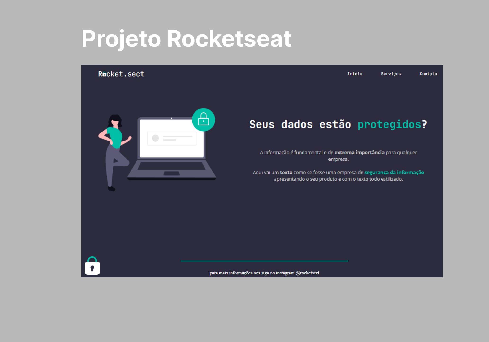

  

<h1 align="center">Desafio intermediário do Explorer - Rocketseat</h1>

Projeto de uma tela inicial de um site de segurança de dados.  

 

  
  <a href="https://jlisarte.github.io/projeto_siteseguranca//" target="_blank">https://jlisarte.github.io/projeto_siteseguranca/</a>

## 🚀 Tecnologias

Esse projeto foi desenvolvido com as seguintes tecnologias:

- HTML e CSS
- Git e Github
- Figma

## 💻 Projeto

A tela inicial transmite ao usuário um resumo do que vai encontrar em um site de segurança de dados.

---

Feito por Shadowkhan - Juliano Lisarte